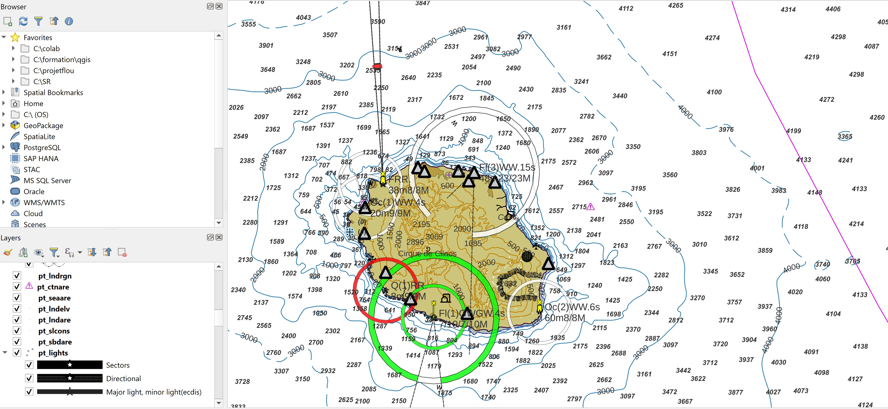

# 🧭 **S57Manager — Plugin QGIS pour la gestion des données ENC (S-57)**

**S57Manager** est un plugin QGIS destiné à faciliter l’import, l’affichage, la gestion et le filtrage des données ENC au format **S-57**.
Il permet notamment :

* l’import automatique des données S-57 vers une base GeoPackage optimisée ;
* l’affichage structuré et thématique des couches ENC ;
* le filtrage des couches par *purpose* (vue d’ensemble, générale, côtière, etc.) ;
* la gestion d’échelles d’affichage par lots ;
* divers outils ENC regroupés dans une interface unique ;
* la prise en charge du **multilingue (FR/EN)**.

---

## 📦 **Fonctionnalités principales**

### 🔹 Import S-57

* Import de fichiers ENC (.000) vers une base GeoPackage.
* Indexation automatique.
* Nettoyage et organisation des tables.
* Barre de progression pendant l’import.

### 🔹 Affichage structuré des couches

* Création d’un groupe QGIS contenant les couches classées par thèmes.
* Styles automatiques.
* Activation/désactivation rapide.

### 🔹 Outils ENC

Accessible via **Menu → S57 Manager → Outils ENC**
Outils disponibles :

* Filtrer les couches par *purpose* (1 à 6).
* Retirer tous les filtres.
* Définir **échelle minimale** et **échelle maximale** pour plusieurs couches sélectionnées.
* Rafraîchissement automatique de la symbologie et du canevas.

### Affichage des couches filtrées

### 🔹 Paramètres du plugin

* Choix du mode de stockage (GeoPackage, dossier S-57, etc.).
* Chemins de données.
* Options avancées.

### 🔹 Traduction (FR/EN)

Le plugin charge automatiquement la traduction correspondant à la langue de QGIS.

---

## 🛠️ **Installation**

### Depuis GitHub

Télécharger le dossier **S57Manager** et l’installer dans :

* **Windows**
  `C:\Users\<Utilisateur>\AppData\Roaming\QGIS\QGIS3\profiles\default\python\plugins\`

* **Linux**
  `~/.local/share/QGIS/QGIS3/profiles/default/python/plugins/`

Puis relancer QGIS.

---

## 🔧 **Compilation des fichiers de traduction**

### Extraire les chaînes à traduire :

```
pylupdate5 plugin.py \
    outils_dialog.py ui_outils_dialog.py \
    gui/*.ui gui/*.py \
    logic/*.py dialogs/*.py \
    -ts i18n/S57Manager_fr.ts i18n/S57Manager_en.ts
```

### Générer les fichiers .qm :

```
lrelease i18n/S57Manager_fr.ts
lrelease i18n/S57Manager_en.ts
```

Les fichiers `.qm` sont placés dans `i18n/`.

---

## 📁 **Structure du plugin**

```
S57Manager/
 ├── plugin.py
 ├── __init__.py
 ├── logic/
 │    ├── importer.py
 │    ├── display.py
 │    ├── db_manager.py
 │    └── settings.py
 ├── gui/
 │    ├── display_dialog.ui
 │    ├── import_dialog.ui
 │    ├── options_dialog.ui
 │    └── progress_dialog.py
 ├── dialogs/
 │    └── options_dialog.py
 ├── i18n/
 │    ├── S57Manager_fr.ts / .qm
 │    └── S57Manager_en.ts / .qm
 ├── outils_dialog.py
 ├── ui_outils_dialog.py
 ├── metadata.txt
 └── README.md
```

---

## 🤝 **Contributions**

Les contributions sont les bienvenues !
Merci d’ouvrir une issue ou une pull request si vous souhaitez :

* proposer une amélioration ;
* rapporter un bug ;
* ajouter de nouvelles traductions.

---

## 📜 Licence

📝 Licence **GPL v3**, comme la majorité des plugins QGIS.

---

