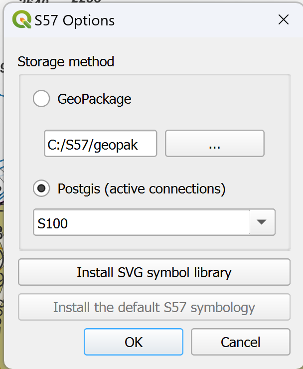
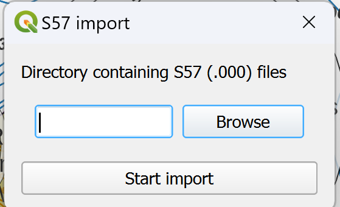
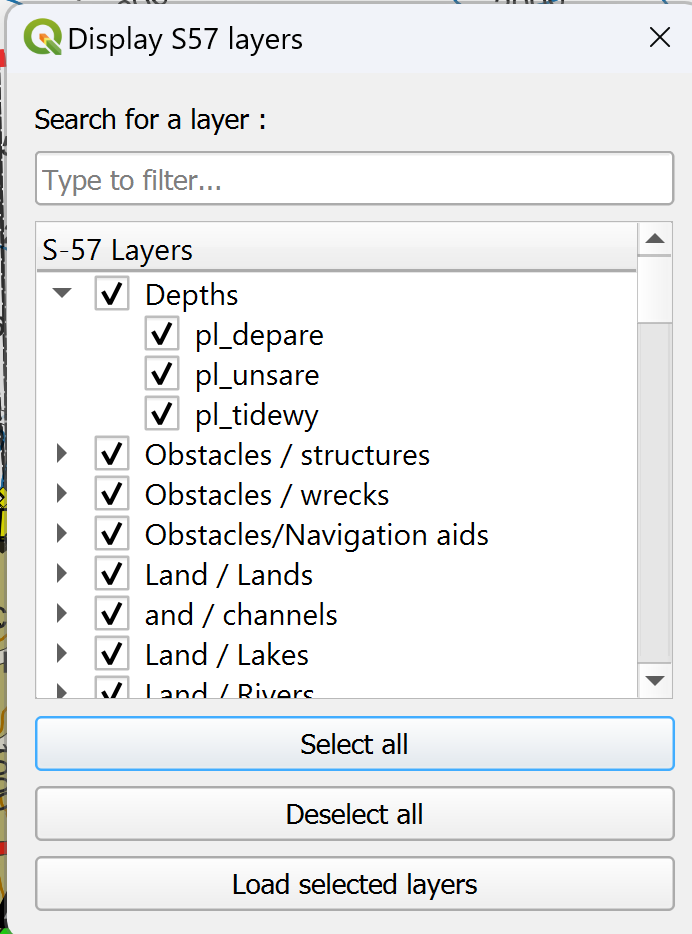
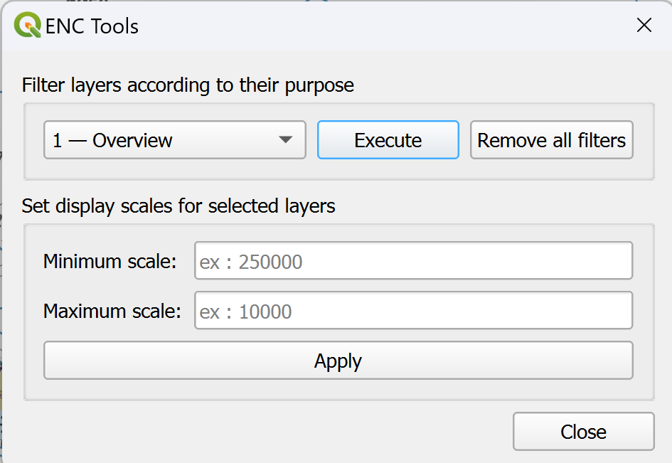
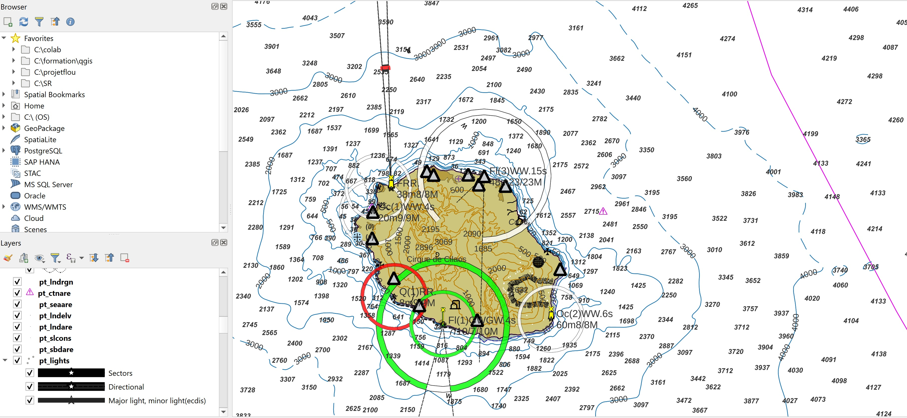
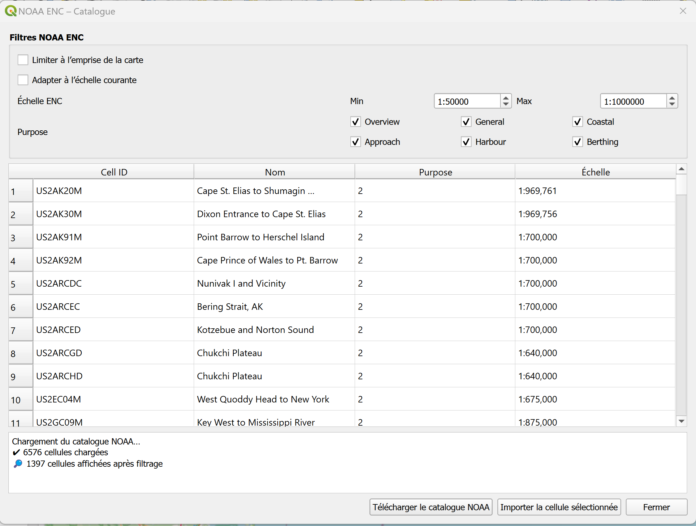
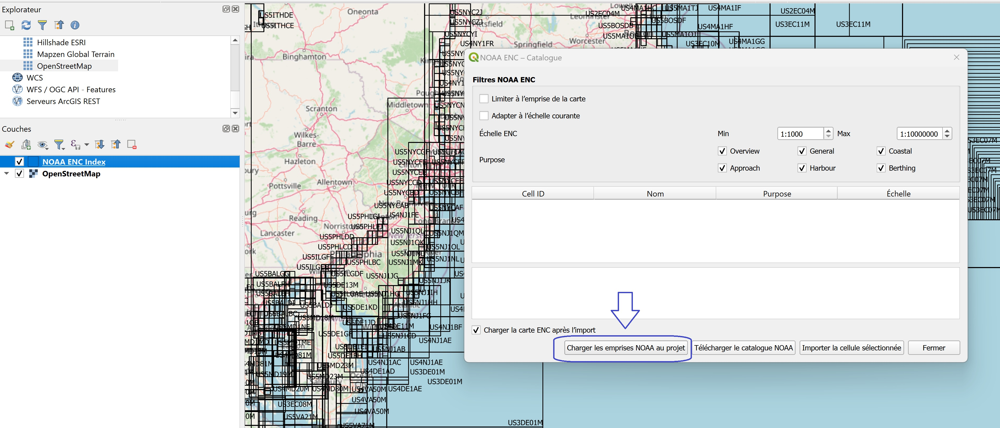

---

# 🧭 **S57Manager — QGIS Plugin for ENC (S-57) Data Management**

**S57Manager** is a QGIS plugin designed to simplify the import, display, management and filtering of marine ENC data in **S-57** format.

It provides:

* automated import of S-57 data into optimized **PostGIS** or **GeoPackage** databases;
* structured and thematic display of ENC layers;
* filtering of layers by *purpose* (overview, general, coastal, harbour, etc.);
* batch management of layer scale visibility;
* a set of ENC-specific tools grouped in a single interface;
* direct access to the **official NOAA ENC catalog** with targeted cell import;
* full **multilingual support (FR / EN / ES / PT)**.

---

## 📘 User Manual / Manuel utilisateur /Manuals del usuario / Manual do usuário

- 🇫🇷 **Français**  
  https://www.sigterritoires.fr/index.php/s57manager/

- 🇬🇧 **English**  
  https://www.sigterritoires.fr/index.php/en/s57manageren/

- 🇪🇸 **Español**  
  https://www.sigterritoires.fr/index.php/es/s57manageres/

- 🇵🇹 **Português**  
  https://www.sigterritoires.fr/index.php/pt/s57managerpt/

## 📦 **Main Features**

* Import of ENC (.000) files into **GeoPackage** or **PostGIS** databases
* Automatic indexing of imported data
* Cleaning and normalization of database tables
* Progress bar during import operations

---

## 🗂️ **Table Organization**

### PostGIS

* Tables are stored in a schema named `enc`
* Table names follow the S-57 object name, prefixed with:

  * `pt_` for point geometries
  * `li_` for line geometries
  * `pl_` for polygon geometries

### GeoPackage

* Tables are stored in a file named `enc.gpkg`
* The same naming convention applies (`pt_`, `li_`, `pl_`)

---

## ⚙️ **S-57 Options**

* Choice of storage mode (PostGIS, GeoPackage, S-57 directory)
* Data path configuration
* Advanced management options
* Automatic installation of ENC SVG symbols



### Important notes

* **PostGIS**

  * The database connection must be active in QGIS
  * Using an empty database is recommended
  * The plugin modifies `public.layerstyle` and creates several working schemas

* **GeoPackage**

  * Only a target directory needs to be specified
  * Required files are created automatically

* The *Install SVG symbols* button installs symbols in the **QGIS user profile**, not in the global SVG directory

---

## 📥 **S-57 Import**



The plugin scans the selected directory and all subdirectories, importing **all `.000` files found**.

---

## 🗺️ **Structured Layer Display**

* Automatic creation of a dedicated QGIS group for ENC layers
* Thematic organization of layers
* Default styles adapted to marine data
* Quick layer activation / deactivation



The loading order is optimized to ensure proper visibility of all layers.

---

## 🧰 **ENC Tools**

Accessible via **Menu → S57 Manager → ENC Tools**

Features:

* Filtering layers by *purpose* (levels 1 to 6)
* Removing all filters
* Setting minimum and maximum scale ranges for multiple selected layers
* Automatic refresh of symbology and map canvas



### Example of final display



---

## 🌐 **NOAA ENC Module**

S57Manager includes a dedicated module for the **official NOAA ENC catalog**, allowing users to search and import ENC cells directly from within QGIS.



### Features

* Automatic loading of the official NOAA ENC XML catalog
* Complete list of available ENC cells
* Dynamic filtering:

  * by *purpose* (levels 1 to 6)
  * by scale
  * by current QGIS map canvas extent
* Import of selected NOAA cells (download + S-57 integration)
* Proper coordinate reference system handling:

  * NOAA extents in **EPSG:4326**
  * Automatic reprojection to the QGIS canvas CRS
* Dedicated dialog integrated into the plugin
* Full multilingual support

---

## 🗺️ **NOAA ENC Index**

A **GeoPackage index of NOAA ENC cells** is included with S57Manager.

When loaded into QGIS, it allows users to:

* visualize NOAA ENC extents
* quickly identify relevant charts
* directly import selected cells via the plugin



---

## 🌍 **Translations**

The plugin automatically loads the translation matching the QGIS interface language:

* French
* English
* Spanish
* Portuguese

---

## 🛠️ **Installation**

### From GitHub

Download the **S57Manager** folder and install it in:

* **Windows**
  `C:\Users\<User>\AppData\Roaming\QGIS\QGIS3\profiles\default\python\plugins\`

* **Linux**
  `~/.local/share/QGIS/QGIS3/profiles/default/python/plugins/`

Then restart QGIS.

---

## 🔧 **Translation File Compilation**

### Extract translatable strings

```bash
pylupdate5 plugin.py \
    outils_dialog.py ui_outils_dialog.py \
    gui/*.ui gui/*.py \
    logic/*.py dialogs/*.py \
    -ts i18n/S57Manager_fr.ts i18n/S57Manager_en.ts
```

### Generate `.qm` files

```bash
lrelease i18n/S57Manager_fr.ts
lrelease i18n/S57Manager_en.ts
```

The generated `.qm` files are placed in the `i18n/` directory.

---

## 📁 **Plugin Structure**

```
S57Manager/
 ├── plugin.py
 ├── __init__.py
 ├── logic/
 │    ├── importer.py
 │    ├── display.py
 │    ├── db_manager.py
 │    ├── settings.py
 │    └── noaa/
 │         ├── catalog.py
 │         ├── downloader.py
 │         ├── importer.py
 │         ├── models.py
 │         ├── noaa_worker.py
 │         ├── updater.py
 │         └── validator.py
 ├── gui/
 │    ├── display_dialog.ui
 │    ├── import_dialog.ui
 │    ├── options_dialog.ui
 │    └── progress_dialog.py
 ├── dialogs/
 │    └── options_dialog.py
 ├── i18n/
 │    ├── S57Manager_fr.ts / .qm
 │    └── S57Manager_en.ts / .qm
 ├── outils_dialog.py
 ├── ui_outils_dialog.py
 ├── metadata.txt
 └── README.md
```

---

## 🤝 **Contributions**

Contributions are welcome!
Please open an **issue** or a **pull request** to:

* propose improvements
* report bugs
* add new translations

---

## 📜 **License**

📝 **GPL v3** license, in line with most QGIS plugins.

---


